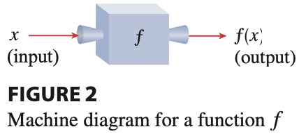
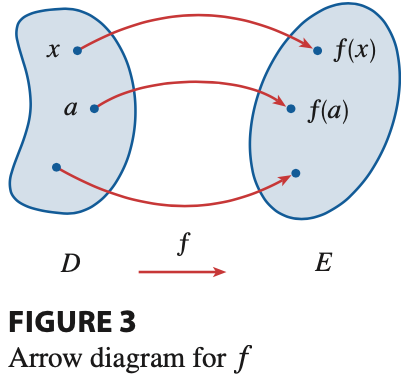

# Intrduction of function

我們常用黑盒子或是工廠來描述函數(function)

假設這個黑盒子或是工廠叫做 $f$ ，把 $x$ 丟進去，出來的東西稱為 $f(x)$ 。
在寫程式時會把 $x$ 稱為輸入 (input)， $f(x)$ 稱為輸出 (output)。

假設 $x$ 所處在的空間叫做 $D$ 我們會用英文 domain 來稱呼這個空間， $f(x)$ 可以待的空間叫做 $E$ ，我們會用 range 來稱呼這個空間。

# 1.1 Four Ways to Represent a Function

這一章節我們會教表示函數的四種方法，

* 用文字描述 (words)
* 用公式表示 (formula)
* 用表格表達 (table of values)
* 用圖展示 (graph)

下面會給 $A, B, C, D$ 四個例子，例子 $A, C$ 用了文字描述與公式描述函數， $B$ 用了表格表達函數， $D$ 用圖展示函數。

## Example 1.1.A （圓面積函數）

一個圓的面積可以視為一個函數 $A(r)$，變數為圓的半徑 $r$ 。
$$ A(r) = \pi r^2 $$
在英文我們會這麼說 $A$ is a *function* of $r$ ，
我們會用獨立變量(independent variable)來叫 $r$ ，因為他不會受到任何限制，
我們可以用 dependent variable 來指函數 $A$ ，因為面積的數值是受到半徑控制，
一般來說你在數學系的課才可以看到這麼漂亮的函數，有關實際的應用通常不會有這麼漂亮的函數解。

## Example 1.1.B （世界人口函數）

我們也可以把世界人口 $P(t)$ 看成一個函數，變數為時間 $t$ ，描述一個函數的第二個方法就是用表格，
你可以發現一般來說，我們可以把我們感興趣的問題寫成一個函數，但是通常就不是很漂亮的函數，但是我們可以用簡單的函數去做逼近與預測，
下表就是用西元的年份去描述當時的人口統計

| 年份 | 世界人口統計 (單位:千萬) |
| :----: | :----: |
| 1900 | 165 |
| 1910 | 175 |
| 1920 | 186 |
| 1930 | 207 |
| 1940 | 230 |
| 1950 | 256 |
| 1960 | 304 |
| 1970 | 371 |
| 1980 | 445 |
| 1990 | 528 |
| 2000 | 608 |
| 2010 | 687 |

我們可以這麼說 $P$ is a *function* of $t$ 。

## Example 1.1.C （花費函數）

大家有去寄過信嗎？還是都寄 email 了，或是大家有去坐跳錶的計程車不是uber那種你輸入上車地點下車地點就跟你說價格的那種，
信封花費

The cost C of mailing an envelope depends on its weight w. Although there is no simple formula that connects w and C, the post office has a rule for determining C when w is known.

## Example 1.1.D

垂直加速度

The vertical acceleration a of the ground as measured by a seismograph during an earthquake is a function of the elapsed time t. Figure 1 shows a graph generated by seismic activity during the Northridge earthquake that shook Los Angeles in 1994. For a given value of t, the graph provides a corresponding value of a.

