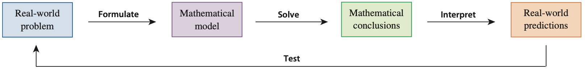

# 1.2 Mathematical Models: A Catalog of Essential Functions

在現實的世界，我們可以不思考的活著，不思考的活著表示只要考慮基本生理需求：食物、水、空氣和睡覺。
當我們想要進一步理解這個世界就需要建立連結，人類區別於其他動物有一點是，人類特別會注意到事物的關聯，
在短時間注意到關聯一般的動物也可以做到，
例如狗的制約實驗，我們每次搖鈴然後餵狗吃飯，久了以後只要搖鈴狗就會流口水，這表示狗已經把搖鈴跟食物兩件事連結在一起，
對於動物時間再拉長一點就不行了（朝三暮四），
但是人特別可以把長時間的關聯性連結起來，所以人類發展出農業，要去更好的預測事物的發展，人類發展出一套數學建模流程。
對於再長的時間人類也會像猴子一樣朝三暮四，無法建立連結，像是皇帝會吃仙丹要短期的精神奕奕放棄長期的健康，有些人會求佛要立即的錢財放棄長遠的富貴。

## 數學建模的流程圖

1. 我們會先對於現實的某項事件感興趣，想要預測或是更好的解釋。
2. 下一步我們會想建立數學模型。
3. 然後我們可以得到數學模型的結論。
4. 看完理論上的結論，我們可以拿來預測真實世界。

如果效果不好，我們可以重複這個步驟，直到我們得到比較好的模型。

## Linear 

## Polynomials

## Power Functions

